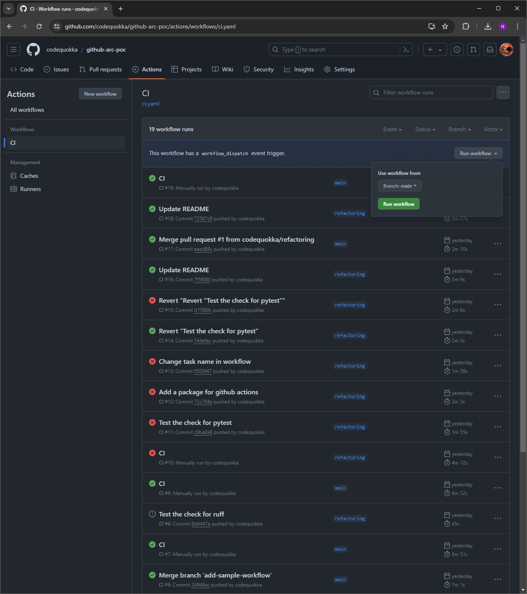
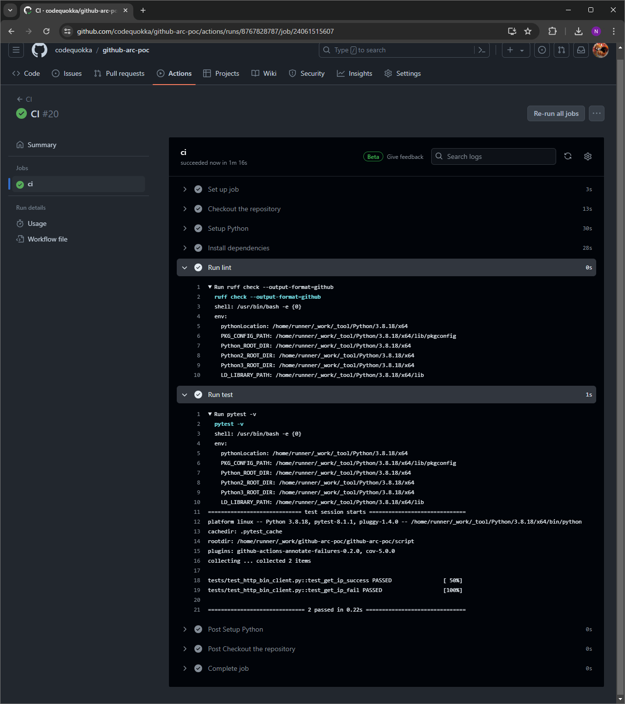

# github-arc-poc
Deploy [Github actions runner controller](https://github.com/actions/actions-runner-controller) with kind and helmfile.

## How to deploy
- [Create the K8s cluster](/kind/README.md)
- [Deploy the Github ARC](/helm/README.md)

## How to run sample workflow
- Run sample workflow manually

