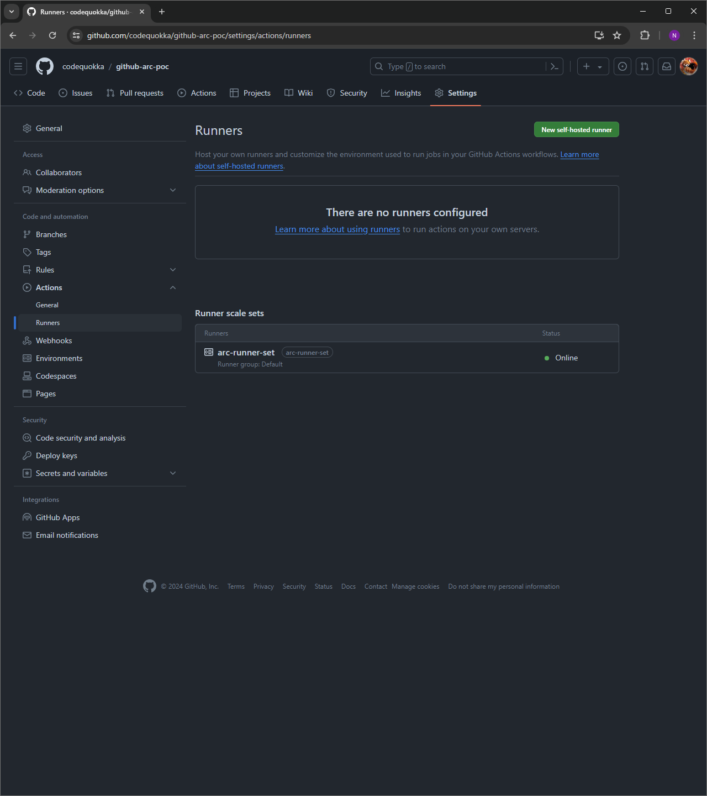

# Deploy the Github ARC

## How to deploy
- Check deployment prerequisites
```bash
❯ cd helm

❯ source .envrc

❯ helm version
version.BuildInfo{Version:"v3.14.4", GitCommit:"81c902a123462fd4052bc5e9aa9c513c4c8fc142", GitTreeState:"clean", GoVersion:"go1.21.9"}

❯ helmfile version

▓▓▓ helmfile

  Version            0.163.1
  Git Commit         8aa524c
  Build Date         25 Mar 24 23:48 UTC (2 weeks ago)
  Commit Date        25 Mar 24 23:45 UTC (2 weeks ago)
  Dirty Build        no
  Go version         1.22.1
  Compiler           gc
  Platform           linux/amd64

❯ age --version
v1.1.1

❯ age-keygen --version
v1.1.1
```

- Install helm plugins
```bash
❯ helm plugin install https://github.com/databus23/helm-diff
<omit>

❯ helm plugin install https://github.com/jkroepke/helm-secrets
<omit>

❯ helm plugin list
NAME    VERSION         DESCRIPTION
diff    3.9.5           Preview helm upgrade changes as a diff
secrets 4.6.1-dev       This plugin provides secrets values encryption for Helm charts secure storing
```

- Create your encryption key
```bash
❯ age-keygen -o key.txt
Public key: <your-public-key>

❯ vi .sops.yaml
```

```yaml
---
creation_rules:
  - age: <your-public-key>
```

- Set your Github repo
```bash
❯ vi github-arc/values-arc-runner-set-poc.yaml
```

```yaml
githubConfigUrl: https://github.com/<your-github-user>/<your-github-repo>
```

- Set your Github PAT
```bash
❯ rm github-arc/secrets-arc-runner-set-poc.yaml

❯ vi github-arc/secrets-arc-runner-set-poc.yaml
```

```yaml
---
githubConfigSecret:
  github_token: <your-github-pat>
```


```bash
❯ helm secrets encrypt -i github-arc/secrets-arc-runner-set-poc.yaml
```

- Deploy github ARC with helmfile
```bash
❯ helmfile diff -e $HELM_ENVIRONMENT
<omit>

❯ helmfile apply -e $HELM_ENVIRONMENT
<omit>
```

- Check github ARC is deployed
```bash
❯ kubectl get pods -n arc-systems
NAME                                             READY   STATUS    RESTARTS   AGE
arc-runner-set-754b578d-listener                 1/1     Running   0          3m24s
arc-systems-gha-rs-controller-547c844bc9-mb2fq   1/1     Running   0          34m
```




## How to undeploy
<!-- TODO -->
